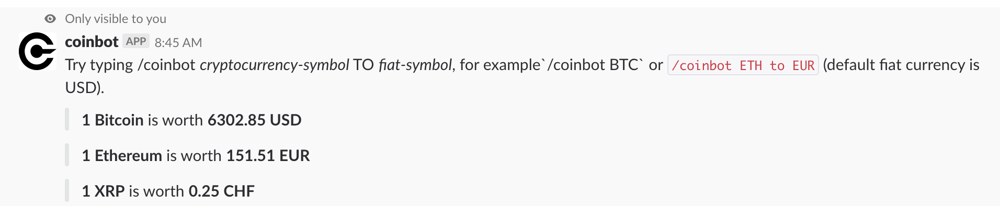

# coinbot-slack-bot

Creating a Slack Bot using Node.js and [botkit framework](https://botkit.ai/). Try typing /coinbot _cryptocurrency-symbol_ TO _fiat-symbol_, for example `/coinbot BTC` or `/coinbot ETH to EUR` (default fiat currency is USD) to get the realtime prices of crypto currencies in fiat.
The bot uses the [coinmarketcap.com api](https://pro.coinmarketcap.com/).

 * Authenticate users with Slack using OAuth
 * Receive messages using the slash_command event (`/coinbot`)

## How to use it

1. Clone the repo, run `npm install`, rename the _.env-test_ file to _.env_
2. Since we're developing locally, we'll need to expose our local development environment to the Internet. [Download ngrok](https://ngrok.com/) and run `./ngrok http 8080` (port is defined in _.env_). Copy the link.
3. Goto — https://slack.com/developers
4. Copy the Client ID, Client Secret and Verification Token
 to .env file in your project
5. Slash Command:
    * Command: /coinbot
    * Request URL: https://XXX.ngrok.io/slack/receive
6. OAuth & Permissions: 
    * Redirect URLs: https://XXX.ngrok.io/oauth
7.  Restart the application and navigate to https://XXX.ngrok.io/login, Authorize
8.  **Have fun!**
